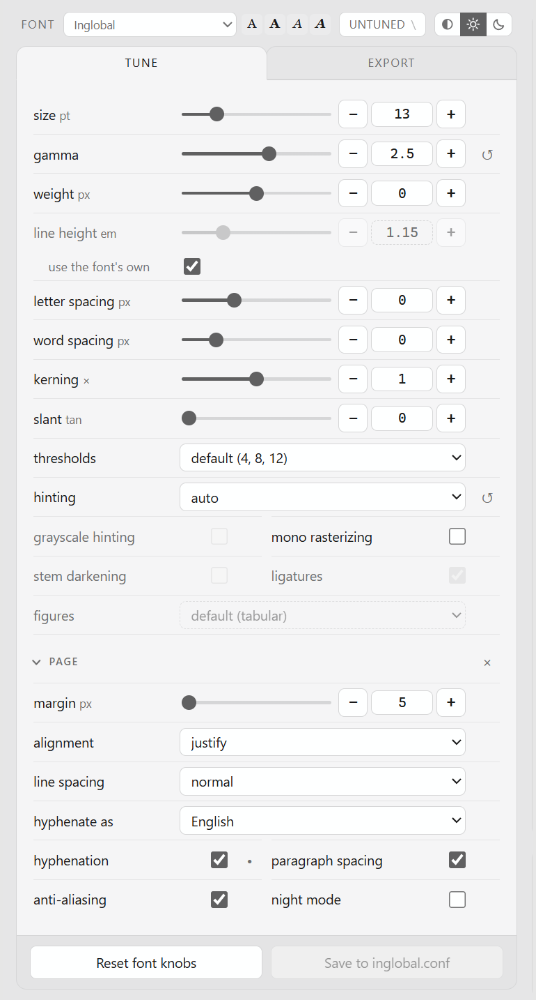
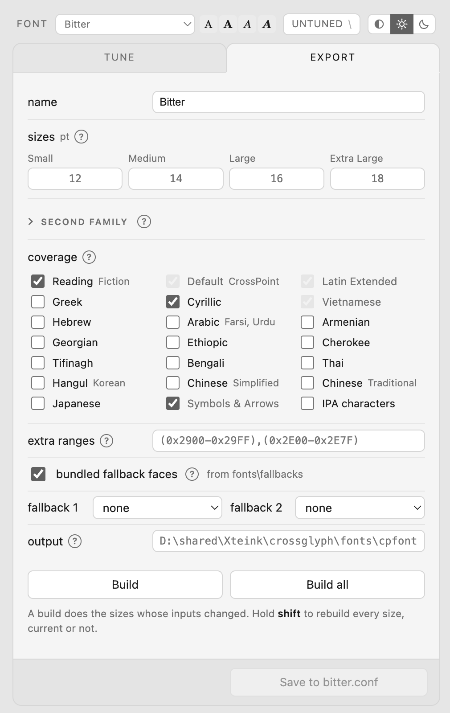

# CrossGlyph

Tune a font for an Xteink reader running
[CrossPoint](https://github.com/crosspoint-reader/crosspoint-reader), and watch
the page redraw as you move each control. A change lands in 10 to 300 ms,
depending on your hardware and how much of the font is being built.

Most fonts need tuning to read well at two bits per pixel. Until now every
guess cost a card swap or an emulator run, so almost nobody went past changing
the point size.

<p align="center">
  <a href="docs/images/tune.png"></a>
  <a href="docs/images/export.png"></a>
</p>

- the firmware's own renderer, its C++ compiled to WebAssembly, so the page is
  what the device draws rather than an impression of it
- fourteen rasterizing controls: gamma, the three grey thresholds, weight,
  slant, hinting mode, grayscale hinting, mono rasterizing, stem darkening,
  line height, letter and word spacing, kerning strength, ligatures,
  proportional figures
- eight page controls, so the page you judge is set up like the device you are
  judging for: margin, alignment, line spacing, hyphenation and the language
  its patterns come from, paragraph spacing, anti-aliasing and night mode
- variable fonts build at the weight their designer named, or at any weight you
  pick: left alone, Merriweather would ship its Light as your Regular
- four sizes of a four-style family, 795 glyphs each with kerning, built in
  about a second, one process per size
- twelve Noto faces on request, so a missing arrow or Greek letter is not a
  hole in the page
- nothing installed system wide, since the launcher fetches uv, Python and the
  dependencies into a cache directory you can delete

CrossGlyph turns TTF and OTF files into `.cpfont`, which is what the device
reads: glyph bitmaps at two bits per pixel, one file per point size, kerning
and ligature tables baked in. The device has no rasterizer, so every size is a
separate build.

## Quick start

1. Unpack the release somewhere you can write to.
2. Run `crossglyph.cmd` on Windows, or `./crossglyph.sh` on macOS and Linux.
3. Put your TTF or OTF files in the `fonts` folder beside the launcher.

The launcher fetches [uv](https://docs.astral.sh/uv/) on first use, which then
fetches Python and the dependencies. Nothing is installed system wide, and the
whole of it lives in a cache directory you can delete. A browser opens on the
first family it finds.

What you unpack holds the launcher, your `fonts` folder, and a `versions`
folder with the code in it. The launcher runs whichever version `current`
names, which is how a later release can be added beside this one rather than
written over it.

CrossGlyph looks for a newer release about once a day and says so when there
is one. `crossglyph update`, or the button in the preview, installs it beside
the version you are on and leaves your fonts and your settings alone;
`crossglyph update --rollback` goes back. Nothing is downloaded or installed
until you ask, and one line in `update.conf` turns the looking off. See
[docs/updating.md](docs/updating.md).

Step 3 is second on purpose: there is nothing to set up before the first run.
An empty workspace opens on Literata, which ships with the tool, so the page
has type on it while you decide what to tune. Add a font of your own and it
takes over.

To build every family in the workspace, with no page in between:

```sh
./crossglyph.sh build
```

To keep the preview running without a terminal window holding it open, there
is `start`, `status`, `restart` and `stop`. `start` opens a browser once the
page answers, `restart` comes back on the same address and picks up an update
if one has been installed, and [docs/preview.md](docs/preview.md) has the
rest.

Windows on ARM is the one platform without ready-made wheels: `freetype-py`
publishes none, so uv tries to compile it and needs a build toolchain.

## Docker

Docker can run the preview and command-line builds with only the `fonts`
workspace mounted from the host. On Windows:

```bat
crossglyph-docker.cmd
```

On macOS or Linux:

```sh
./crossglyph-docker.sh
```

The launcher waits for a healthy preview, then prints its browser address, the
mounted workspace and the commands for logs and shutdown. Add `--local` to
build from the unpacked release or checkout instead of pulling CrossGlyph's
published image. The image installs nothing on the host and publishes the
preview on `127.0.0.1` by default. [docs/docker.md](docs/docker.md) covers the
raw Compose commands, image tags, batch builds and remote hosting.

## The workspace

The `fonts` folder sits beside the launcher, outside `versions`, so an update
only ever adds to it: a file you edited is kept, with the new one written
beside it as `<name>.new`. It holds four things:

```
fonts/
  NotoSans-Regular.ttf   your font files, at the root
  NotoSans-Bold.ttf
  conf/                  one <family>.conf per family, and all.conf
  fallbacks/             the bundled Noto faces, once fetched
  cpfonts/               what gets built
```

`$CROSSGLYPH_FONTS` names another workspace, and so does `--fonts DIR`. Builds
land in `cpfonts` unless `out` in `all.conf` says otherwise.

A family needs no config at all. Drop four files in, name them the way their
foundry did, and they build on the next run. `all.conf` holds settings shared
by every family and ships commented out, so it sets nothing until you edit it.
Write a `<family>.conf` when one family needs settings of its own. See
[docs/fonts.md](docs/fonts.md) for every key, and for what the tuning controls
actually do.

## Getting the fonts onto the device

Copy a built family folder from `cpfonts` into `/fonts` on the SD card, or into
`/.fonts` to keep it out of the file browser. The device scans both at boot,
and the family then appears under **Settings > Reader > Font**.

The point sizes offered are the ones you built. A family built at 12, 14 and 16
offers three of them.

## Fallback faces

CrossPoint draws nothing for a codepoint no font in the chain has, so a family
that lacks an arrow leaves a gap where it should be. Twelve Noto faces fill
those holes, covering Hebrew, Armenian, Georgian, Ethiopic, Cherokee, Tifinagh,
Coptic, mathematics, symbols and emoji.

They are OFL licensed and unmodified, so they are downloaded rather than
shipped here:

```sh
./crossglyph.sh fetch-fallbacks
```

That is 3.4 MB, and it puts `OFL.txt` beside them. A CJK face is another
15.7 MB and comes only when something has asked for it: a config naming a CJK
script, or, in the preview, text on the page that cannot be drawn without one.
One face answers all four languages, Korean included, so there is no choice to
make between them.

The preview offers the same download as a button, with a bar, since it takes a
while. Bundled fallbacks are off by default, which keeps a first build
self-contained and makes a narrow face about twelve times smaller. After
fetching them, turn on **bundled fallback faces** in the preview or set
`fallbacks = yes` in a config to fill codepoints the family lacks.

## What is here

| | |
|---|---|
| `src/crossglyph/` | the converter, the workspace rules and the preview server |
| `src/crossglyph/cpfont/` | the `.cpfont` writer, forked from the tool behind the CrossPoint website |
| `src/crossglyph/render/` | the firmware's renderer, compiled to WebAssembly, and the Python that drives it |
| `src/render/` | the C++ and the build script that produce that module |
| `src/crossglyph/starter/` | Literata, the family an empty workspace opens on |
| `docs/` | [fonts.md](docs/fonts.md) for building, [preview.md](docs/preview.md) for the renderer, [docker.md](docs/docker.md) for containers, [updating.md](docs/updating.md) for the update check |

CrossGlyph is MIT licensed. See [THIRD-PARTY-NOTICES.md](THIRD-PARTY-NOTICES.md)
for the code it carries, and [CONTRIBUTING.md](CONTRIBUTING.md) to work on it.
