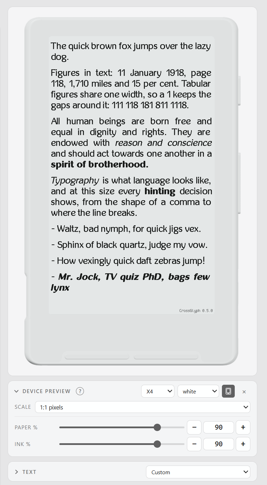

# The preview

<p align="center">
  <a href="images/preview.png"></a>
</p>

The preview draws one page of text the way the reader would draw it, and
redraws it every time you move a control. It is where you decide how a font
should be built, before anything is copied to a card. What it shows is the
device's own drawing code, so the page is not an approximation of the reader.

```sh
./crossglyph.sh preview                    # the first family in the workspace
./crossglyph.sh preview --family notosans  # a family by name
./crossglyph.sh preview --font one.ttf     # a file that is in no family
./crossglyph.sh preview --no-open --host 0.0.0.0          # for a container
./crossglyph.sh preview --fonts ~/other-fonts             # another workspace
./crossglyph.sh preview --family notosans --png page.png  # one page, no server
```

Every rendered PNG carries `CrossGlyph X.Y.Z` in gray at the bottom right. The
watermark is added after the device render, so it is not part of the simulated
framebuffer.

`--fonts` is the same flag `build` takes, and it answers the same question:
which folder holds the families. Unset, it falls back to `$CROSSGLYPH_FONTS`,
and then to the `fonts` folder beside the launcher.

`--family` takes a name from the workspace. It resolves the four faces the same
way a build does: from the family's own `.conf` if it has one, otherwise from
`all.conf` and the filenames, honouring any face pinned in either. A name that
matches nothing lists the families that are there. `--bold`, `--italic` and
`--bold-italic` work beside it and each overrides one face.

The picker at the top left switches families without a restart. The family
rides on each render request, and the build cache is keyed on the faces, so
returning to a family you were just looking at costs nothing. If you started on
a bare `--font`, that file stays at the top of the list as a separate choice.
It belongs to no family and cannot become one.

The picker always ends with Literata, which ships with the tool and is marked
`(bundled)`. Its faces are read where they are installed, and nothing is copied
into your workspace. It gives a first run some type to look at, and it stays
afterwards as somewhere to flip to: a face you know is good, at the size and
the knobs you are working at.

Being in the picker does not put it in your workspace. `crossglyph build` with
no arguments, and **Build all**, build the families in your folder and leave
the bundled one alone. Name it and it builds. Pressing **Save** on it writes a
`literata.conf` naming `dir`, and from then on it is a family like any other
and builds with the rest.

The server runs until you stop it. It reads the Python once at startup, so a
change to the source needs a restart. Ctrl+C ends the one in the window holding
it. `crossglyph stop --port 8000` ends one on any address, foreground or
background, whether or not this install started it.

Starting a second preview on a port that is already held prints what is there
and what to do about it:

```
a preview is already running on http://127.0.0.1:8000. Open that one, or stop it with `crossglyph stop`.
Serve one beside it with `crossglyph preview --port 8001`.
```

The port it offers is one nothing is listening on, so you can run that line as
printed.

## In the background

Tuning a font is something you come back to over days, and the terminal window
holding the server open does nothing else. So it can run without one:

```sh
./crossglyph.sh start                 # start it, and open a browser on it
./crossglyph.sh start --port 8123 --no-open
./crossglyph.sh status                # what is running, and which version
./crossglyph.sh restart               # same address, same family
./crossglyph.sh stop
./crossglyph.sh stop --port 8123      # that one, whoever started it
```

`start` takes every option `preview` takes, so `--family`, `--font`, `--host`
and `--port` mean the same things. It waits for the page to answer before it
prints anything. A start that failed says so at the prompt, and never opens a
browser on nothing; the reason is in `preview.log` beside the launcher.

### Asking what is running

`status` asks the server itself, so it reports whatever is actually serving. A
process list would only show what was launched:

```
preview on http://127.0.0.1:8000
  pid 41288, crossglyph X.Y.Z, up 2h
  fonts /home/you/crossglyph/fonts
  log /home/you/crossglyph/preview.log
```

The workspace and the pid come from the server, not from the command line.
Both `--fonts` and `$CROSSGLYPH_FONTS` move the workspace. The process that
serves is also not always the one that was launched: uv's venv python starts
the real interpreter, so a pid remembered at the spawn would be a wrapper, and
stopping that would leave the server holding the port.

A preview that has stopped answering while its process is still there is
reported as exactly that. A stop has to be able to end that state:

```
a preview on http://127.0.0.1:8000 (pid 41288) is not answering.
`crossglyph stop` will kill it.
```

`preview.log` is written unbuffered, so you can read it while the server is
still up. A buffered one would fill in at the moment it exits.

### Another address, and another tool's port

`stop` and `status` take `--host` and `--port` too. There the address picks
which preview to act on. Without one they act on the preview this install
started, the only one it keeps a note of. With one they act on whatever answers
at that address, so you can ask about a foreground `crossglyph preview`, or a
second instance on another port, and stop it the same way. A port on its own
keeps the running preview's host.

When what answers is not the tracked preview, the report says so. A bare `stop`
or `restart` will leave it alone, and it has no start time or log to report:

```
preview on http://127.0.0.1:8123
  pid 41290, crossglyph X.Y.Z
  fonts /home/you/crossglyph/fonts
  not the preview this install is tracking, so a bare stop or restart leaves it alone
```

Naming a port nothing is serving says which port. A port held by something that
is not CrossGlyph is left alone, never killed.

`restart` takes what it is not told from the start it replaces. Bare, it comes
back on the same address showing the same family; `restart --port 9000` moves
only the port. It also picks up an update, because it resolves the version to
run at the moment it starts one. So `crossglyph update` followed by
`crossglyph restart` installs a release and runs it, and `status` names it
afterwards so you can see which one answered. Between the two, `status` says so
as well:

```
  X.Y.Z is installed; a restart would run it
```

Starting one that is already running is not an error. It says where the running
one is and opens the browser, which is what you asked for. It refuses when the
port is held by anything else, and it says which of the two you have hit: a
preview this install did not start and a stranger's server are answered
differently. It also refuses while a preview it tracks is on an address other
than the one you named.

Stopping goes through the server instead of a signal. Windows has no SIGTERM,
and a detached process has no console for a Ctrl+Break to arrive through.
`POST /shutdown` is that request, and it answers a loopback client only. A
preview on `--host 0.0.0.0` serves its pages to the network, and accepts a
shutdown only from the machine it runs on. There is no token, because a token
cannot help here. A browser elsewhere could only learn one if the page carried
it, and a page that carries it hands it to everyone who can load the page.

## When the folder changes underneath it

The font folder is not only the app's to change. A font gets dropped into it,
a config gets edited in an editor, a docker volume gets a new file from
outside the container, all while the page is open.

Reaching the folder means leaving the window, so coming back to the page is
when it asks again. On tab focus it re-reads the folder, and a font added,
removed or retuned since the last look appears in the picker. Nothing polls, so
a tab you are not looking at does no work at all.

What you are tuning keeps its place through that. The picker does not move
under you, and unsaved knobs are never overwritten: they are the only thing on
the page with nowhere else to live. When the open family's config changes on
disk:

- with nothing of yours in the panel, it follows the file and redraws
- with unsaved knobs, they stay, the page says the file changed, and the
  revert arrows compare against the file as it now is

A family whose files have gone falls back the way a fresh page would.

## What the controls do

Font controls (gamma, weight, line height, the spacings, kerning, slant,
thresholds, hinting, grayscale hinting, mono rasterizing, stem darkening,
ligatures, figures) rebuild the `.cpfont` behind the page.
The ones whose names give least away carry a **?** beside the label with the
short version in it, and
[Tuning how glyphs look](fonts.md#tuning-how-glyphs-look) explains what each
one does to the type at length. [The same settings in the
preview](fonts.md#the-same-settings-in-the-preview) gives what each one is
called in a config, for the few whose names differ.

Page controls (margin, alignment, hyphenation and the language its patterns
come from, line spacing, paragraph spacing, anti-aliasing) are the reader's own
settings, and they only re-lay-out. The language list holds every one the
firmware carries patterns for. On the device that comes from the book's own
metadata instead. A control that cannot apply is greyed and stays visible, so
hyphenating as Russian is not offered while hyphenation is off.

**thresholds** is a picker and not a free field. It lists three sets, each a
step darker than the last: default (4, 8, 12), darkened (3, 6, 10) as the
built-in fonts have it, and darkest (2, 5, 9). A config may set any
ascending triple within 1 to 15, and a family whose config carries one gets an
entry naming it. That entry goes when you switch to a family without one.

Reach for **gamma** first, though. Thresholds only redistribute the coverage
FreeType already produced, where gamma changes how much there is.

### Hyphenation has three states

`off` at the bottom of the language list is the third, and not a second way to
untick the box. The difference shows on any text with a compound in it:

```
hyphenation off            was re-established after the
                           cost-benefit analysis of the
                           counter-example.

hyphenation on, off        was re-established after the cost-
                           benefit analysis of the counter-
                           example.
```

With hyphenation off the reader never breaks inside a word. With it on and no
language, it breaks at hyphens the text already carries and adds none of its
own. That is what the device does with a book whose language it does not
recognise, so it is worth being able to look at. A language on top of that adds
its patterns.

### Steppers, and how far a press moves

Each numeric knob has a slider for covering distance and a field with `-` and
`+` buttons for landing on a value.

Hold shift on a stepper for a bigger step. Each knob declares its own, in the
unit it counts in: a whole point of size, half a point of gamma, a pixel of
letter spacing, five pixels of margin, five percent of a device setting. No
arithmetic over a knob's range would know that, which is why the markup carries
it. The value lands on a multiple of that step, so from 13.25 the size knob
goes to 14, then 15.

A numeric axis of a variable font is built from whatever the font carries and
has no such declaration to make, so it derives a round number sized off its
range: sixteen coarse presses from one end of the axis to the other. Holding a
stepper repeats it either way.

### The Page section

The **Page** section starts folded. Its settings describe the device you are
judging against, so you set them once and leave them, while the controls above
are what a session is actually spent on. The browser remembers them, so they
survive a reload and every font you try, and it remembers whether you left the
section open. A dot on the folded heading means one of the settings inside is
not what the device ships with. It is the same dot the individual rows carry,
shown for the section while those rows are out of sight.

### Why a control is greyed

A greyed row is one that would change nothing about this font, and each of them
says why. The row stays where it is instead of disappearing, so a panel does
not change shape as you switch families.

The font decides two of them. **ligatures** needs the font to carry ligature
rules, in a table called GSUB, and **figures** needs a feature called `pnum`
that many fonts do not have. A family with neither draws the same page
whichever way those are set, so both rows are greyed for it and say
which feature is missing. Every face is asked, because a family whose regular
has ligatures and whose bold does not still has something to turn off. A face
that will not open leaves the rows live: greying them would be a claim about a
font that was never read.

**stem darkening** is greyed by the font and the **hinting** row together,
which makes it the confusing one. FreeType darkens in two engines: the Adobe CF2
interpreter that draws CFF and Type 1 faces, and the auto-hinter. Each adds a
condition on top. CF2 darkens a scaled load, and the auto-hinter darkens at a
light target. A TrueType family has no CF2 path, so the switch leaves it
unmoved except with hinting on **light**, the one setting that hands it to the
auto-hinter. Nothing moves under **auto** either: that targets normal hinting
and reloads the glyph unscaled, failing both conditions at once. Turn hinting
and the row follows.

Only those two cases are greyed, so the switch may still do nothing where it is
left live. A CFF face whose stems fall where the darkening curve rounds to
nothing is unmoved too, and that cannot be known without rasterizing the page
both ways. A face FreeType calls tricky never reaches the auto-hinter at all,
so **light** does nothing for it either. Both are left live, because greying a
switch that works is the worse mistake.

**grayscale hinting** and **mono rasterizing** are greyed on separate facts.
The first picks FreeType's other bytecode interpreter, so it is out of reach
for a face with no bytecode to run: a CFF family, a TrueType family with no
instructions, and any family under `light`, `auto` or `none`, where the
auto-hinter draws instead. It is out of reach while **mono rasterizing** is on
as well, since FreeType hints the way that interpreter does whenever the
raster is monochrome, whichever of the two you have picked. The second leaves a pixel empty or full. While it is
on there is no coverage in between for **gamma** or the thresholds to act on,
so those two rows are greyed.

### Night mode

It is the reader's inverted screen. The device draws the page exactly as it
does by day, then flips the finished picture on its way to the screen, so what
moves is the level each pixel lands on: paper and ink swap, and the two greys
swap with each other. The flip runs over those four levels and not over a 0
to 255 range, which would ask for greys this panel cannot make. Look at a font
both ways: a face that is comfortable in black on white can read heavy in
white on black.

## Device preview

The **Device preview** under the page puts the rendered screen into an X3 or
X4 body. It starts folded. X4 is the default; choosing X3 redraws at its native
528 by 792 pixels instead of resizing the X4's 480 by 800 output. The body
color follows the page's light or dark appearance until you select black or
white. That choice is remembered independently from the page appearance. The
reader icon removes the body while keeping the selected screen proportions and
rounded corners.

**Scale** has four settings:

- **1:1 pixels** maps one reader pixel to one physical monitor pixel, whatever
  ratio the browser puts between its own pixels and the screen's. Nothing is
  resampled, the body included: each device ships a second render of its frame
  whose screen opening is the panel's own size, and this scale draws that one
  at its own pixels. The other
  scales take the taller render, which has the resolution they ask for.
- **Device size** uses the reader body's documented dimensions at 100%.
- **Fit** scales the selected body or bare screen into the available window.
- **Custom** applies 50% to 150% of the documented device size. It shows a
  100 mm ruler and the same slider and stepper controls as the numeric tuning
  knobs. Hold a physical ruler against the line and adjust until they match.
  Repeat this after moving the window to a monitor with a different scale.

**Paper** and **Ink** remap the panel's four levels without rebuilding the
font. Both run from 50% to 100% in the direction their labels imply: more paper
is lighter, and more ink is darker. Both default to 90%.

**Warm** and **Tint** shade those levels to match the display you are reading
on. The device is not neutral. Photographed on white paper in shade, its body
and panel both read a faint warm green, and the preview ships carrying that.
This end cannot know whether the constant suits your monitor and your room, so
it is a pair of knobs and not a fixed value.

Warm is how far red sits above blue. Tint is how far green sits above the mean
of the two. Both are in display levels, and neither can change the level
itself. That is why there are two knobs and not three: the third degree of
freedom is lightness, and paper and ink already own it. They ship at 3 and 2.5,
the measured cast to the level. Zero on both is a true neutral grey, and at 90%
paper that is `#e6e6e6`, the same grey the interface around it is built from.

The frame follows the page, because the body and the paper it surrounds are the
same hue and have to stay that way. The shift shows on a white body and barely
registers on a black one, whose level is 13, but it is the same shift either
way.

Paper, ink, warm, tint and the custom scale each grow a small arrow while they
sit away from what they ship at. Pressing it puts that one knob back, and the
ruler with it. This is a plain reset. The arrow in the tuning column does
something else: it sets your value aside so you can flick between the two.
There is no config behind these, only the value the page declares, so there is
no second value to hold on to. Scale is the one control without an arrow. It is
a dropdown that already shows every value it has.

These choices and the tone values are remembered in this browser. **Reset
device preview** restores all of them at once: the X4 frame, 1:1 pixels, 90%
tones and the measured cast. It does not change the font or its saved config.

Nothing written to a `.conf` carries them, and neither does a build. They are a
viewing setting, and the copy below is the one thing that takes them with it.

### Copying the preview

The button beside the frame toggle copies the preview to the clipboard as a
PNG. Hold Shift and it downloads instead, and the icon changes while the key is
held so the press says which it will do.

Copying is a browser feature that only works on a secure page, which means
`localhost` or https. A preview reached over plain http at some other address,
as `--host 0.0.0.0` serves, says so when you press it and leaves you the Shift
half, which has no such condition.

What you get follows the frame toggle: the reader body around the page when the
frame is shown, the page alone at the panel's own size when it is not. Either
way it is built at the panel's resolution, so the type is exactly the pixels the
device would draw, whatever scale the page is set to. The X4 gives 612 by 996
framed and 480 by 800 bare, the X3 671 by 1011 and 528 by 792.

Nothing is painted behind it. The body is cut out of its surround, the bare
screen is rounded off at its own corners, and everything outside is
transparent, so the image drops onto whatever you put it on and carries no
rectangle to crop off. Somewhere that flattens transparency, as a document or a
chat message may, fills that in with its own background. Even a white body on
white still reads, because the edge is in the render and not in a surround
behind it.

## Comparing what you changed

To see what your tuning is doing, take it away: **untuned** at the top, the `\`
key, or press and hold the page itself. The size stays where it is, since it is
the size you are working at and not part of the tuning. Holding is a look and
not a change, so whatever the toggle was set to comes back on release.

Size is a view setting. The browser remembers it for the next visit, but it is
not written to the family's config, and neither reset action changes it.

### The arrow beside a knob

That arrow compares one knob. It is a comparison and not a reset: your value is
set aside, one press brings it back, and you can flick between the two as often
as it takes.

Which value it offers depends on where the knob stands. While your value
differs from the one in the config, the arrow offers the config's, which
answers "undo what I just did to this row". Once the two agree, and saving
makes them agree on every knob at once, it offers the stock value instead,
which answers "what is this font doing on its own". Leave a knob on stock and
it differs from the config again, so the arrow turns back the other way. Hover
it to see which of the two it is holding.

The value the arrow set aside lasts as long as the panel does. It is one press
from coming back, but a reload, a switch of font, or the config changing on
disk all drop it without asking. So a prompt about switching font asks only
about what is on screen, which is what **Save** would write. While the arrow is
on you are looking at the config's own value, so nothing prompts at all.

Numeric axes of a variable font, such as `wdth`, use the same arrow. The
family's config is the first comparison, the default declared by the font is
the stock comparison, and **untuned** shows that stock value. Weight pickers
stay face choices, and are not one shared tuning axis.

A switch has no arrow. The value you are not looking at is the other one, a
click away on the box itself, so there is nothing to set aside. A checkbox
carries a mark instead: it says the row differs, and the tooltip says which way
the baseline has it.

### Putting a whole section back

**Reset font knobs**, in the bar at the foot of the card beside **Save**, puts
the whole section back, the weight pickers of a variable family included. Those
go to the weight the family declares: the one in its config where it has one,
and the instance the font itself names where it has not. They do not go to the
first entry in the picker. The cross on the **Page** heading does the same for
the section under it.

## Saving

**Save** writes the whole `.conf`, the font controls and the export settings
together. That is why it sits in the bar at the foot of the panel rather than
among the controls, and why ticking a coverage box lights it up exactly as
moving a slider does.

A family that `all.conf` covers without naming has no file of its own. Saving
it writes a new `<family>.conf` and leaves `all.conf` alone, since editing that
would retune every family in the workspace.

## The export panel

The export panel holds the settings that decide what a build writes: the family
name, the point sizes, the coverage, and the fallback families. Press the **?**
beside a label to read what that setting does.

The four **sizes** boxes cover what most families ship. The **second family**
section builds those same faces again under the same name plus a suffix, at
another set of sizes, and the device lists that as a font of its own beside the
first. It is not a way past a limit on sizes: one family carries as many as you
give it. Use it when two entries in the font list suit you better than one
entry with a long list of sizes under it. The section starts folded, and a dot
on its heading means this family has one.

On a window wide enough for three columns the panel gets one of its own beside
the page. On a narrower window it shares a column with the font controls, and
the **Tune** and **Export** tabs at the top choose which of the two you see.
The page itself stays where it is either way.

### Name

**name** is what the family is called once it is built, whatever the source
files happen to be called. It reaches a filename, so it keeps letters, digits,
`_` and `-` and nothing else: the rest is stripped on the way in, and the box
shows what landed. Empty means the name the files already have.

Two families may not build under one name, since they would write over each
other in the output folder, so a name another family has taken is refused with
a line saying which. A second family counts as a name, being called after the
first one. The picker follows a rename as soon as it is saved, and so does any
family falling back to the one that moved.

### Sizes

**sizes** is what the reader's Font Size setting will list, one entry per box.
It is not the **size** knob on the left, which is only the size you are looking
at.

Both take quarter points over the same 6 to 40 range, because a whole point is
2.08 px/em at 150 DPI and about a 10% jump at reading sizes. So you can step
through the page until 13.25 looks better than 13, then put 13.25 in a box.
Anything between two steps rounds to the nearer one when you leave the box, and
anything outside the range is pulled back in, so the sizes you ship are sizes
you were able to look at first.

A family may carry more than four sizes, and the boxes are not the limit: a
config with a longer list of them opens a **more sizes** field beside the boxes
holding the rest. The field appears only for a family that already has one, so
a fifth size is added in the config rather than here.

A comma is a decimal point in one of those boxes, since each holds a single
size. In **more sizes**, which is a list, it separates one from the next, and so
does a space.

Press a box's title and the knob goes to what that box holds, which saves
typing a shipped size in to look at it. The knob takes the size the box will
hold rather than the characters in it, so a box still being typed into shows as
it will land and an empty one does nothing.

**A fractional size ships under a whole number.** It is rasterized at the size
you asked for, and the device parses the size out of the filename into a single
byte that cannot hold a fraction. So 13.25 builds `Family_13.cpfont` and the
Font Size list reads 13 while the glyphs are 13.25 pt. The line under the boxes
says so whenever a size is fractional, naming the file each one will write. Two
sizes that round to the same label would write over each other, so that line
turns into a warning and the save refuses it: 13.5 and 13.75 are both 14.

### Coverage

The page draws what a build of this coverage would draw. A preview build is
sized to the text in the box rather than to the whole coverage, which keeps it
to a few dozen glyphs, but it is held to what the coverage would carry. Untick
a range the text uses and the page goes blank where those characters are,
exactly as the built font would. A family cannot look finished here and reach
the device unreadable.

When that happens the note under the box says how many characters it is and
which preset would carry them, and that preset's tick is marked in the coverage
row, so the answer sits where it gets applied. Nothing is ticked for you.
Coverage is what a build writes, and that is not a setting to change behind
your back.

The presets overlap, and the row says so instead of leaving you to work it out.
Reading is the converter's Default block and a good deal more, so ticking it
shows Default, Latin Extended, Symbols and Vietnamese as carried, greyed, and
out of your hands while it is on. A preset you chose that another of your
choices already covers stays yours to untick, greyed with a note saying it adds
nothing. Greek and Cyrillic are never carried: Reading has the main blocks but
not polytonic Greek or the Cyrillic Supplement, so ticking those still adds
something. Only what you chose is written to the config.

## Building

The export panel has a bar at its foot, the way the font controls do:
**Build** and **Build all**, a progress bar under them, and one line saying
what is building now or what the last build made. Both are there whether or not
anything is running, so a build changes what the bar says and never how tall it
is. Press the **?** beside the buttons for what each one does.

There is no **Save** on this tab, because a build saves before it starts.
Pressing Build is pressing Save and then Build, so a second button for the first
half of that would only be one to press by mistake.

That leaves nothing to light up when an export setting is not in the file yet,
so the tabs show it instead. A dot on **Tune** means something among the font
controls is unsaved, and a dot on **Export** means something in the export
panel is. Neither tab marks itself, since the panel you are looking at shows
its own state. While a build runs, the **Export** tab carries that instead of
the unsaved dot: a build takes minutes, you may well be looking at the other
tab, and the file has been written by then anyway.

A build reads the `.conf` from disk and takes nothing from the page, which is
why the save has to happen first. A coverage tick that never reached the file
would leave every size looking up to date, and that reads as a build that did
nothing rather than as a change that was never seen.

### What a run tells you

A build runs its sizes across a process pool, the same one the command line
uses, so a family with four sizes takes about as long as its slowest one rather
than all four end to end. They finish in whatever order they finish in.

It reports as it goes, which matters because a build with the fallbacks on runs
for minutes. The bar under the two buttons fills with the sizes done, and the
line under it names the family and size in hand, the count, and once there is
enough of the run to judge by, what is left.

The sentence that stays when it finishes says what was built, what was already
current and anything that failed, with the bytes beside each count. A card has
a fixed amount of room, and a build is when you want to know what a family
costs on it. The two numbers answer different questions: what this run wrote,
and what the sizes it left alone already take up. A count of nothing is left
out instead of written as a zero. Where it all went is not in that line, since
an output path is most of a panel wide and the box three rows up is already
showing the folder.

### Warnings and failures

Anything a run had to complain about appears in a row under that bar, marked
the way the note under the sample text is. A size that failed shows there, with
what the converter said about it. So does a coverage preset the build could
draw nothing of, named as the tick you put there, with the box or the **Fetch**
button offered where one of those is the answer. A tick that drew a stray
character or two shows there as well, saying almost nothing rather than
nothing: a box like
**Chinese (Simplified)** covers the fullwidth punctuation as well as the
characters, and an ordinary Latin face draws some of that.

Lines that say the same thing are joined, so building every family in the
folder gives you one line and the families in front of it. The row is empty when
a run starts and stays hidden when there was nothing to report.

### Rebuilding, and tidying up

A build does the sizes whose inputs changed. Hold shift and it does the lot,
current or not. That is what you want when the inputs are the same and the
answer should not be: a converter that has moved on, or a face edited in place.
Both buttons say **Rebuild** for as long as the key is held.

A build also tidies the output folder against the workspace. A family you
renamed, dropped, or took the second size list off leaves a whole directory
behind, and the note says which ones went. Either button does it, because what
belongs in that folder does not depend on which family you pressed Build on. A
family whose config still names it keeps what it built even when its face has
gone missing, and a directory the tool did not build is never touched.

## The render core

The page is not a reimplementation of the device's renderer. It is the
renderer: `EpdFont` and `GfxRenderer` from the firmware, compiled to
WebAssembly, driven from Python. Bytes in, bytes out, no syscalls.

That is what makes the preview honest. Everything that decides how a page looks
lives in those files: how a `.cpfont` is read, how a character is painted at
four grey levels, where lines break, how justification distributes slack, how
hyphenation patterns apply. A Python reimplementation would agree with the
device until it did not, and the disagreement would be silent.

The module is `src/crossglyph/render/render.wasm`. Most of its size is the
compiled hyphenation patterns for the languages the firmware carries. It is
committed, because a release has no toolchain to build one with. See
[CONTRIBUTING.md](../CONTRIBUTING.md) for rebuilding it.

### Freestanding, and why that is enforced

WASI is the standard way a WebAssembly module asks its host for anything
outside itself. This module asks for three functions and nothing else:
`fd_close`, `fd_seek` and `fd_write`. libc links stdio unconditionally, so they
come along even though nothing calls them. They are standard, so any host can
satisfy them, and a browser needs no shim beyond an off the shelf one.

A test asserts that set exactly. A new import is a regression worth failing on,
because the browser version of this page has to load the same module with only
the Python wrapper replaced.

### Knowing when it is stale

The build writes a stamp beside the module holding the firmware it came from:
the repository, the branch and the commit. If a firmware checkout sits beside
this repository and has moved past that commit, the preview says so once and
draws anyway:

```
warning: the render core was built from crosspoint-reader develop 45caec3e76c2,
         and D:\...\crosspoint-reader-engine is now at 9f1c0a2b4d31.
         The preview draws with the older renderer until you rebuild it:
  bash D:\...\src\render\build.sh
```

An older renderer draws the page that older firmware drew, and that beats no
preview. The warning exists because whoever moved the checkout is the one
person who can rebuild the module, and it is said once per run, never once per
redraw.

The checkout it compares against is `crosspoint-reader-engine` if there is one,
a clone kept for the engine and left on `develop`, and a plain
`crosspoint-reader` otherwise. That split lets a working checkout sit on any
branch without the preview having an opinion about it. See
[CONTRIBUTING.md](../CONTRIBUTING.md) for keeping it current.

Without a checkout there is nothing to compare against, so nothing is claimed
and nothing is printed. That is the released case, and the reason the module
ships built. `$CROSSGLYPH_FIRMWARE` names a checkout somewhere other than
beside this repository.

An explicit path is taken at its word. `load_module(path)` skips the check,
because a caller naming a file has already said which one they mean.

## Speed

A control moves and the page redraws. Everything on that path is cached.

The workspace is walked once per family and the result held, so moving a slider
does not re-resolve the folder. Kerning is read out of the font's own table
once per face, size and figure setting, since reading it twice for the same
font is most of the cost of a rebuild. Rendered pages are cached on the whole
request, so returning to a setting you just left costs nothing.

The page coalesces its own requests. Dragging a slider issues one render at a
time and discards what is superseded, so a drag cannot queue thirty renders and
then serve them all.

First use of a family is slower than the rest, because that is where the folder
walk and the GPOS read happen. After that a control turn is tens of
milliseconds. The page prints the elapsed time under the image.

## The sample text

The **Text** card starts folded and remembers whether it is open. Its language
picker stays in the heading, so changing the sample does not require opening
the text and its notes.

The picker holds one preset per language, and the page opens on one the browser
says you read. A sample you cannot read says nothing about a font you are
choosing.

Each preset holds three things: the sentence the device itself shows under
Settings > Font, which uses every letter of that alphabet, Article 1 of the
Universal Declaration of Human Rights in the same language, and a short English
paragraph so a font that has to carry both scripts can be judged on both.
Between them they exercise what a font decision depends on: digits padded to a
common width, a justified line, a word long enough to hyphenate, and emphasis
inside running text. See `src/crossglyph/preview/samples.py`.

Custom is the first entry and holds whatever you type. Choosing a language
never costs you your own text, and switching back returns it; typing while a
preset is showing moves the picker to Custom under your hands. Both the choice
and your own text are remembered between sessions.

Choosing a preset moves `hyphenate as` with it when the core has patterns for
that language, and leaves it alone when it has none, so a Japanese sample is
not quietly hyphenated as English.

Your own text is in some language too, so Custom keeps a `hyphenate as` of its
own and brings it back with the words. Set one while Custom is showing and it
is remembered; go through a preset and return, and both the text and the
language you were reading it in come back. Changing `hyphenate as` while a
preset is showing is about that sample and is not kept, and Custom with
nothing of its own recorded leaves whatever is showing alone.

On a first visit only, the browser's languages also pick `hyphenate as`,
English when none of them has patterns. That is a default and not a decision:
it is never written down, and the cross on the **Page** heading goes back to
it.

### When a character will not draw

If the family and its fallbacks have no glyph for something on the page, a line
under the box says how many characters that is. The line is there because a
glyph the device does not have gets no width at all, so a paragraph of them is
blank space and not a row of boxes. A page with a hole in it looks exactly like
a page that failed to draw.

The remedy is under Export: **bundled fallback faces**, a set of Noto families
covering most scripts, and the **Fetch** button beside it while any of them is
still to get. A workspace filled by an older version can be short a
face this one added, so the note beside the button says how many are left
rather than only whether the folder is there. Whichever of the two is the move left to make is
marked the way an unticked coverage preset is, so the answer sits where it gets
applied. Naming a family in **fallback 1** answers it as well, and is the only
answer left once the bundled faces are on and have no glyph either.

A fetch takes the page into account. Pressing **Fetch** on a Japanese sample
brings the large CJK face as well and turns the box on, so you do not have to
work out which coverage would have asked for it. One CJK face answers Japanese,
Korean and both Chinese scripts. It is a slow download, so the same bar the
build uses says how far it has got, and the button is out until it finishes.

So does the offer. That face comes only when something asks for it, which
means a workspace can hold every other face and still be short of it, and the
folder on its own cannot tell you. The count is worked out again on each
render, against the text and coverage in front of you. Paste Japanese into a
fully fetched workspace and the button comes back with one face to bring.

A face the folder does not have stops nothing. The page draws with the faces
that are there and counts what none of them could draw, and a build writes the
family those faces can make. Refusing would produce no font and leave the
folder exactly as empty. What each does instead is say what is absent: the page
beside the button that fetches it, and a build in one line naming the files and
the command.

## What this is not

The preview draws one page of sample text. It is not the reader: no chapters,
no pagination, no images, no tables, no footnotes. What it covers is what a
font decision depends on.
