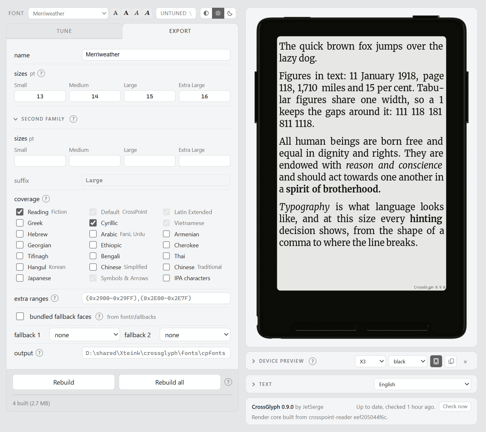
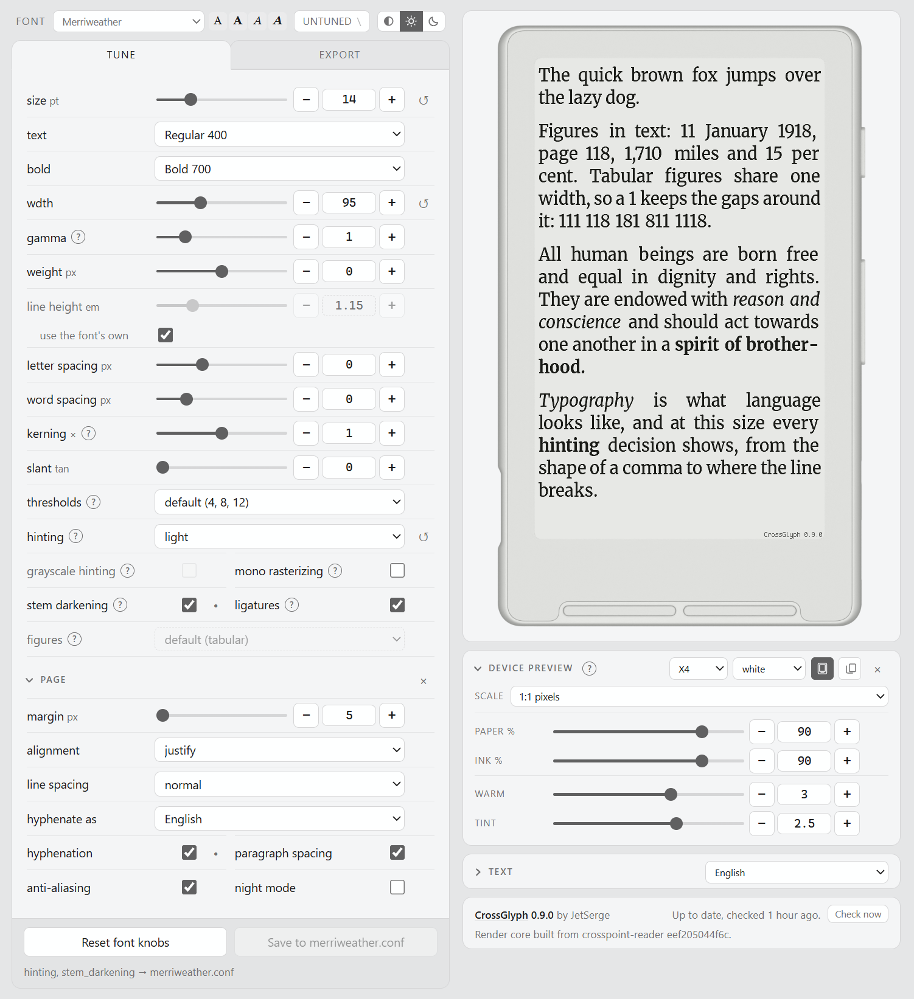
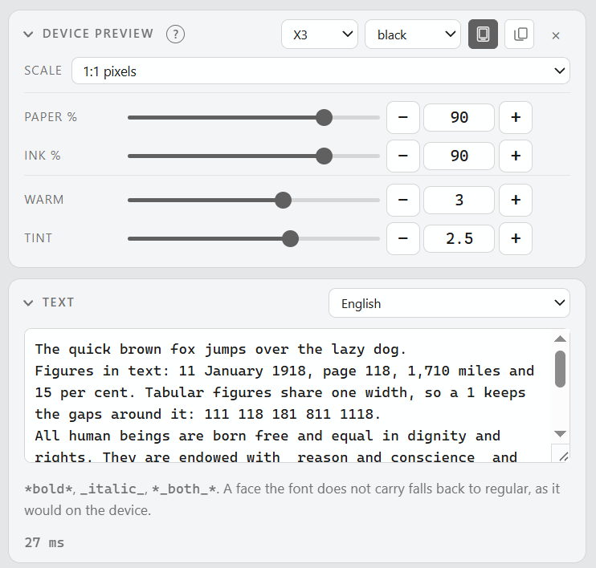
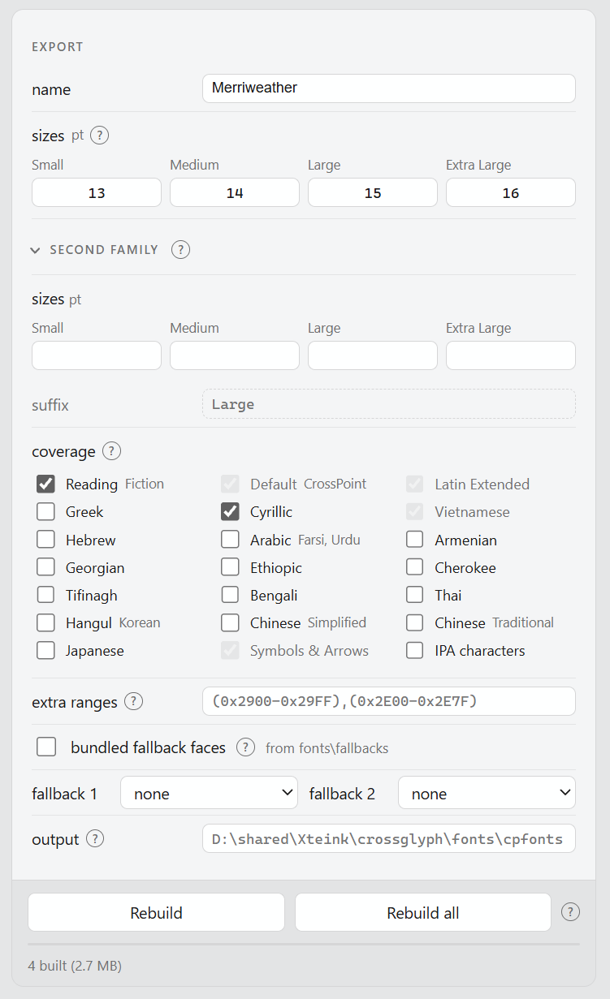

# The browser preview

The preview shows a page as CrossPoint draws it. Font controls rebuild the
preview font. Page controls lay out the page again. Both changes appear in the
browser as soon as they are ready.

<p align="center">
  <a href="images/preview.png"></a>
</p>

For a first build, follow [Getting started](getting-started.md). This page is a
reference for the browser interface. Command-line options are in
[Command line](cli.md).

## Layout

Most screens use two columns. **Tune** and **Export** are tabs in the left
column. The rendered page and its viewing tools are in the right column.

Wide screens use three columns by default:

1. **Tune** on the left
2. the rendered page in the middle
3. **Export** on the right

Narrow screens use one column. **Tune** and **Export** remain tabs. The selected
panel appears above the rendered page.

The layout changes automatically with the browser width. It does not change
what a control does.

## What affects the built font

The page contains settings with different purposes:

| Part of the page | Purpose | Saved in the font config | Affects Build |
|---|---|---:|---:|
| **Tune** font controls | Change glyphs and font metrics | Yes | Yes |
| **Export** | Choose the files to build | Yes | Yes |
| **size** at the top of Tune | Choose the preview size | No | No |
| **Page** | Match CrossPoint reading settings | No | No |
| **Device preview** | Change the reader frame and display appearance | No | No |
| **Text** | Choose the sample text | No | No |

This distinction is important. **Page** can make the same font wrap and look
different, but it does not alter the `.cpfont` files.

## Choose a family

The **font** list at the top of the page contains the families found in the font
source folder. It also contains the bundled Literata family.

The four style markers beside the list show which faces are available. The
sample text uses bold and italic where it can, so missing styles are easy to
spot.

Return to the browser after adding, removing or editing font files. CrossGlyph
checks the folder when the tab receives focus and refreshes the family list.

## Choose the preview size

The **size** control selects the point size used by the rendered page. It is a
viewing choice. The browser remembers it.

The point sizes that Build creates are under **sizes** in **Export**. Changing
the preview size does not add that size to the build.

Use several preview sizes while tuning. Thin strokes, spacing and hinting can
behave differently at each size.

## Tune the font

The main controls in **Tune** change the font that Build will create.

| Control | What it changes |
|---|---|
| **gamma** | Overall ink coverage. Raise it to darken the letters. |
| **weight** | Stroke thickness without changing the requested point size. |
| **line height** | Distance from one line of text to the next. |
| **letter spacing** | Extra space after each character. |
| **word spacing** | Extra space added to normal spaces. |
| **kerning** | How strongly the font adjusts selected letter pairs. |
| **slant** | Adds an artificial slant when a style needs one. |
| **thresholds** | How the rendered coverage is divided into four grey levels. |
| **hinting** | How outlines are fitted to the pixel grid. |
| **grayscale hinting** | Uses the TrueType interpreter intended for grey pixels. |
| **mono rasterizing** | Builds black-and-white glyphs instead of four-level glyphs. |
| **stem darkening** | Thickens eligible outlines before rasterizing them. |
| **ligatures** | Joins sequences such as `fi` when the font provides that form. |
| **figures** | Chooses the font's default digits or proportional digits. |

A **?** button beside a control opens a short explanation. A greyed control
cannot affect the selected font under the current settings. The reason appears
with the control.

### Variable fonts

A variable family shows **text** and **bold** weight lists near the top of
**Tune**. They choose the weight used for the regular and bold styles.

Optical size is not a panel control. When a variable font has an optical-size
axis, CrossGlyph sets it from each point size being built.

## Compare changes

Use **untuned** at the top of the page to show the font without the current Tune
changes. The preview size stays the same. You can also press and hold the
rendered page for the same comparison.

A curved arrow beside one control compares only that control with its saved
value. Press it again to return to the value you were testing.

**Reset font knobs** restores all Tune controls to their default values. It does
not change Page, Text or Device preview settings.

## Check how sharp the strokes are

Under the text box, beside the render time, the page shows its **Grid Fit**:

```text
Grid Fit 90 (+22) | X 95 Y 75
```

The screen is a grid of pixels, and each pixel shows one of four levels of
grey. A straight stroke that lands exactly on whole pixels is black to its
edges. One that lands between pixels gets a column of grey beside it, and on an
e-ink screen that grey reads as blur. Grid Fit counts that grey along the
straight strokes of the text on the page, from 0 to 100. **X** is the upright
strokes, such as the stems of `n` and `l`. **Y** is the flat ones, such as the
bar of `e` or the top of `T`.

It measures sharpness, not whether the font looks good. Curves need their grey
to look smooth, so they are not counted.

- The number in brackets is how much the last change moved it. It compares two
  pages of the same text, so changing the text starts again.
- The score is for the text on the page, weighted by how often each letter
  appears. A few lines of ordinary prose give a steady score. With too few
  letters the line ends in **few letters**.
- Press the score to see it for each style on the page.
- With **mono rasterizing** there is no grey, so there is no score.

Point size changes Grid Fit more than most controls do: a quarter of a point
can move a stem onto whole pixels or off them. **Fit to grid** under
[Export](#fit-sizes-to-the-pixel-grid) searches for those sizes for you.

## Match the reading page

Open **Page** near the bottom of **Tune**. These controls reproduce page choices
that CrossPoint applies while reading:

- **margin** changes the space around the text;
- **alignment** chooses justified, left, centered or right-aligned text;
- **line spacing** applies the reader's tight, normal or wide spacing;
- **hyphenate as** chooses patterns for the sample text;
- **hyphenation** turns those patterns on or off;
- **paragraph spacing** adds space between paragraphs;
- **anti-aliasing** changes how the four font levels are painted;
- **night mode** inverts the finished page.

Page settings affect only the browser preview. Save and Build leave them out of
the font config. The browser remembers them so you can keep testing fonts with
the same reading setup.

A real book supplies its own language metadata. Set **hyphenate as** to the
language of the sample text you pasted into the preview.

**Reset page settings** returns the section to its starting values.

<p align="center">
  <a href="images/tune.png"></a>
</p>

## Change the sample text

Open **Text** below the rendered page. Choose one of the supplied samples or
select **Custom** and paste your own text.

Use text that represents the books you read. Include bold, italic, digits,
punctuation and any scripts that matter to you. The note below the text reports
characters that the current coverage or fallback choices cannot draw.

The browser remembers custom text and the selected sample. Text is a preview
input and is not stored in the font config.

## Use the device preview

Open **Device preview** below the rendered page. It can show the page inside one
of the reader frames included with CrossGlyph or as a bare screen.

The controls include:

- **scale** chooses one screen pixel per monitor pixel, a physical-size view or
  a fit-to-column view;
- **paper** changes the displayed paper brightness;
- **ink** changes the displayed ink strength;
- **warm** and **tint** adjust the screen cast;
- the copy button copies the preview as a PNG;
- holding Shift while pressing the copy button downloads the PNG.

These are viewing settings. They do not change the font or its config. The
browser remembers them.

<p align="center">
  <a href="images/preview-text.png"></a>
</p>

## Save font settings

**Save** writes the Tune and Export settings to the selected family's config
file. It becomes available when those settings differ from the saved values.

Save writes the values shown on the page. Finish any comparison before saving
if you want to keep the value you were testing.

A family discovered from filenames may not have its own config file yet. Save
creates one for that family instead of changing the shared settings for every
family.

## Choose export settings

**Export** controls what Build writes:

- **name** is the family name shown by the reader;
- **sizes** lists the point sizes to build;
- **Second family** can create another family entry from the same source faces;
- **coverage** chooses character ranges;
- **extra ranges** adds raw Unicode ranges;
- **bundled fallback faces** adds the downloaded Noto families after your own
  faces;
- **fallback 1** and **fallback 2** choose workspace families that fill missing
  characters first;
- **output** shows where the built family is written.

The **Small**, **Medium**, **Large** and **Extra Large** labels are buttons. Press
one to preview the point size in its box.

A second family is optional. Leave its size boxes empty for one family entry.
Use it when two separate entries in the reader's font list are clearer than one
entry with a long size list.

Coverage controls which characters are placed in the files. More coverage
creates larger files and takes longer to build. Fallback faces fill characters
that the main family lacks.

<p align="center">
  <a href="images/export.png"></a>
</p>

## Fit sizes to the pixel grid

**Fit to grid**, beside **sizes** in **Export**, suggests point sizes whose
straight strokes land more cleanly on the screen's pixels. It scores the text
on the page with the current Tune settings, as [Grid Fit](#check-how-sharp-the-strokes-are)
does.

1. Put a few lines of the kind of text you read on the page.
2. Press **Fit to grid**. It scores the sizes in your boxes.
3. Press a value in the **size** or **suggested** column to show the page at
   that size. Press the other one to compare.
4. Untick any suggestion you do not want.
5. Press **Apply**. The suggestions go into the size boxes.
6. Press **Save** or **Build** to keep them.

Each suggestion stays within half a point of its size and keeps the number
the reader shows in its Font Size list. A box that holds 13.75 ships as 14, as
any fractional size does.

A suggestion is ticked when it gains at least a few points. A size that is
already the best has nothing to tick. **Undo** puts the boxes back as they
were before **Apply**. **Close** discards the suggestions.

To choose new sizes instead, select **a range**, enter the smallest and largest
size and choose **4** or **8** sizes, then press **Find sizes**. Four fill the
first row of boxes. Eight fill both rows, and the panel says what that builds:

- with the **suffix** under **Second family** empty, one family with eight
  sizes;
- with a suffix, two families, the second named with the suffix.

Fit to grid does not change the suffix.

## Build

**Build** builds the selected family. **Build all** builds every family in the
font source folder.

Both buttons save the Tune and Export settings before starting. CrossGlyph
builds the point sizes whose inputs changed. Hold Shift to rebuild every size.

The progress line names the current family and size. Warnings and failures
appear below the buttons. See [Troubleshooting](troubleshooting.md) for the
common messages.
